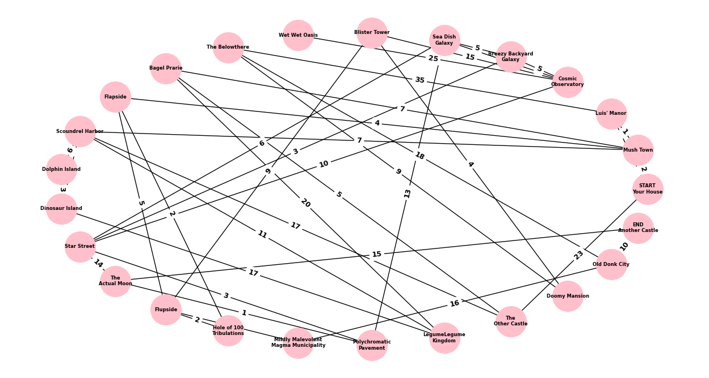

# Title of Your Project

**CISC320 Spring 2023 Lesson 14 - Graph Applications**

Group Members:
* Allison Ziegler alzig@udel.edu
* Ellie Noonan enoonan@udel.edu
* Dean Turner turnerde@udel.edu
* Alexandra Croce acroce@udel.edu

Description of project

## Installation Code

```sh
$> pip install networkx
```

## Python Environment Setup

```python
import networkx as nx
```

# First Problem Title

**Informal Description**: 

> **Formal Description**:
>  * Input:
>  * Output:

**Graph Problem/Algorithm**: [DFS/BFS/SSSP/APSP/MST]


**Setup code**:

```python
```

**Visualization**:


**Solution code:**

```python
```

**Output**

```
```

**Interpretation of Results**:


# Second Problem Title

**Informal Description**: 

> **Formal Description**:
>  * Input:
>  * Output:

**Graph Problem/Algorithm**: [DFS/BFS/SSSP/APSP/MST]


**Setup code**:

```python
```

**Visualization**:


**Solution code:**

```python
```

**Output**

```
```

**Interpretation of Results**:


# Mission 3: Let's-a-Go (along the shortest path possible)

**Informal Description**: You've taken on the role of a copyright-free plumber, perhaps of Southern European origin and dressed in at least one of the three primary colors. You know that the princess of an unspecified fungus-related kingdom has been kidnapped by some sort of strange, talking turtle-dragon creature, and it's your mission to save her. To do so, however, you must travel a long way to the fabled "Another Castle." The road is long and winding, but surely there's a way to find the shortest path from your house to your destination, right?

> **Formal Description**:
>  * Input: A weighted, undirected graph G, with V vertices and E edges, and a specified source vertex S and target vertex T
>  * Output: The single-source shortest path from vertex S to vertex T

**Graph Problem/Algorithm**: [SSSP/Dijkstra's Algorithm]


**Setup code**:

```python
from networkx.algorithms import tree
import matplotlib.pyplot as plt
import networkx as nx
import numpy as np


G = nx.Graph()
G.add_edge("START\nYour House", "Mush Town", weight=2)
G.add_edge("START\nYour House", "Luis' Manor", weight=4)
G.add_edge("Cosmic\nObservatory", "Breezy Backyard\nGalaxy", weight=5)
G.add_edge("Cosmic\nObservatory", "Sea Dish\nGalaxy", weight=8)
G.add_edge("Cosmic\nObservatory", "Blister Tower", weight=15)
G.add_edge("Cosmic\nObservatory", "Wet Wet Oasis", weight=25)
G.add_edge("Luis' Manor", "Mush Town", weight=1)
G.add_edge("Luis' Manor", "The Belowthere", weight=35)
G.add_edge("Mush Town", "Bagel Prarie", weight=7)
G.add_edge("Mush Town", "Flapside", weight=4)
G.add_edge("Mush Town", "Scoundrel Harbor", weight=7)
G.add_edge("Dolphin Island", "Scoundrel Harbor", weight=6)
G.add_edge("Dolphin Island", "Dinosaur Island", weight=3)
G.add_edge("Breezy Backyard\nGalaxy", "Sea Dish\nGalaxy", weight=5)
G.add_edge("Star Street", "Cosmic\nObservatory", weight=10)
G.add_edge("Star Street", "Breezy Backyard\nGalaxy", weight=3)
G.add_edge("Star Street", "Sea Dish\nGalaxy", weight=6)
G.add_edge("Star Street", "The\nActual Moon", weight=14)
G.add_edge("Flapside", "Flupside", weight=5)
G.add_edge("Flapside", "Hole of 100\nTribulations", weight=2)
G.add_edge("Mildly Malevolent\nMagma Municipality", "Flupside", weight=11)
G.add_edge("Hole of 100\nTribulations", "Flupside", weight=2)
G.add_edge("Scoundrel Harbor", "Dinosaur Island", weight=12)
G.add_edge("Polychromatic\nPavement", "Star Street", weight=3)
G.add_edge("Polychromatic\nPavement", "The\nActual Moon", weight=1)
G.add_edge("Dinosaur Island", "LegumeLegume\nKingdom", weight=17)
G.add_edge("LegumeLegume\nKingdom", "Scoundrel Harbor", weight=11)
G.add_edge("Flupside", "Blister Tower", weight=9)
G.add_edge("LegumeLegume\nKingdom", "Bagel Prarie", weight=20)
G.add_edge("Bagel Prarie", "The\nOther Castle", weight=5)
G.add_edge("The\nOther Castle", "START\nYour House", weight=23)
G.add_edge("The\nOther Castle", "Scoundrel Harbor", weight=17)
G.add_edge("Blister Tower", "Doomy Mansion", weight=4)
G.add_edge("Doomy Mansion", "The Belowthere", weight=9)
G.add_edge("Sea Dish\nGalaxy", "Polychromatic\nPavement", weight=13)
G.add_edge("Old Donk City", "Mildly Malevolent\nMagma Municipality", weight=16)
G.add_edge("Old Donk City", "The Belowthere", weight=18)
G.add_edge("Old Donk City", "END\nAnother Castle", weight=10)
G.add_edge("The\nActual Moon", "END\nAnother Castle", weight=15)

plt.figure(figsize=(16,8))
layout = nx.shell_layout(G, rotate=0)
labels = nx.get_edge_attributes(G, 'weight')
nx.draw(G, layout, node_size=1500, node_color="pink", with_labels=True, font_weight='bold', font_size=6, horizontalalignment="center")
nx.draw_networkx_edge_labels(G, pos=layout, edge_labels=labels, font_weight='bold', font_size=9)
```

**Visualization**:



**Solution code:**

```python
output = nx.dijkstra_path(G, "START\nYour House", "END\nAnother Castle", weight='weight')
print(output)
plt.show()
```

**Output**

```
['START\nYour House', 'Mush Town', 'Flapside', 'Hole of 100\nTribulations', 'Flupside', 'Mildly Malevolent\nMagma Municipality', 'Old Donk City', 'END\nAnother Castle']
```

**Interpretation of Results**:


# Fourth Problem Title

**Informal Description**: 

> **Formal Description**:
>  * Input:
>  * Output:

**Graph Problem/Algorithm**: [DFS/BFS/SSSP/APSP/MST]


**Setup code**:

```python
```

**Visualization**:


**Solution code:**

```python
```

**Output**

```
```

**Interpretation of Results**:

