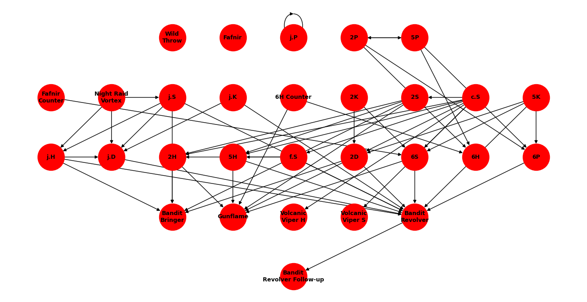

# It's Dangerous to Code Alone: Graph This!

**CISC320 Spring 2023 Lesson 14 - Graph Applications**

Group Members:
* Allison Ziegler alzig@udel.edu
* Ellie Noonan enoonan@udel.edu
* Dean Turner turnerde@udel.edu
* Alexandra Croce acroce@udel.edu

This set of problems takes various graphing algorithms and ties them together under a video game theme. It provides a variety of graphs and situations to be solved by four different algorithms: Depth-First Search, Breadth-First Search, Dijkstra's Algorithm, and Prim's Algorithm.

## Installation Code

```sh
$> pip install networkx
```

## Python Environment Setup

```python
import depthFirst.py
import networkx as nx
```

# Mission 1: The Island of Secret Chambers

**Informal Description**: You have just arrived on the island of secret chambers. Your mission is to travel to each secret chamber on the island. On the arrival of each chamber, a secret will be revealed. You must collect each secret before completing this level. Once a secret is revealed, your strength will grow. Use this to your advantage as the island is heavily guarded by gremlins that live on the paths. The good news is that your grandfather has passed down a sketchbook that includes drawings of the island. With the help of your grandfather's sketchbook, create a map of the secret chambers on the island as well as the gremlins that guard each path. Each node will represent a secret chamber, each edge will represent a path that can be taken, and each weight will represent the gremlins to be defeated on each path. Using this map, you must determine the order in which you seek each chamber by constructing a Minimum Spanning Tree of the island. Good luck and safe travels!

> **Formal Description**:  
>  * Input: A weighted undirected graph G=(V,E) with edge weight w.
>  * Output: The shortest path that visits each vertex and minimizes the total weight of all edges.

**Graph Problem/Algorithm**: [MST/Prim's Algorithm]


**Setup code**:

```
from networkx.algorithms import tree
import matplotlib.pyplot as plt
import networkx as nx
import numpy as np
Graph = [
    [0, 7, 0, 0, 0, 13, 0, 0, 0, 0, 0, 0, 12, 0, 0, 0, 0, 0, 0, 11],
    [7, 0, 4, 0, 0, 0, 0, 0, 0, 13, 0, 0, 0, 0, 9 ,0, 0, 0, 0, 0],
    [0, 4, 0, 7, 0, 0, 0, 0, 0, 0, 0, 0, 0, 0, 0, 0, 0, 0, 0, 0],
    [0, 0, 7, 0, 16, 0, 0, 0, 0, 0, 0, 0, 0, 0, 1, 0, 0, 0, 31, 0],
    [0, 0, 0, 16, 0, 8, 0, 0, 0, 0, 0, 0, 0, 0, 0, 0, 0, 0, 0, 0],
    [13, 0, 0, 0, 8, 0, 10, 0, 0, 0, 0, 11, 0, 0, 14, 0, 0, 19, 0, 0],
    [0, 0, 0, 0, 0, 10, 0, 9, 0, 0, 0, 0, 0, 13, 0, 8, 7, 0, 0, 0],
    [0, 0, 0, 0, 0, 0, 9, 0, 2, 0, 0, 0, 0, 18, 0, 24, 0, 0, 16, 0],
    [0, 0, 0, 0, 0, 0, 0, 2, 0, 3, 0, 0, 20, 0, 24, 0, 0, 0, 0, 0],
    [0, 13, 0, 0, 0, 0, 0, 0, 3, 0, 1, 0, 0, 0, 0, 0, 0, 0, 0, 0],
    [0, 0, 0, 0, 0, 0, 0, 0, 0, 1, 0, 4, 0, 0, 0, 0, 0, 0, 0, 0],
    [0, 0, 0, 0, 0, 11, 0, 0, 0, 0, 4, 0, 9, 0, 0, 0, 0, 0, 0, 0],
    [12, 0, 0, 0, 0, 0, 0, 0, 20, 0, 0, 9, 0, 12, 0, 0, 0, 0, 0, 0],
    [0, 0, 0, 0, 0, 0, 13, 18, 0, 0, 0, 0, 12, 0, 4, 0, 0, 0, 0, 0],
    [0, 9, 0, 1, 0, 14, 0, 0, 24, 0, 0, 0, 0, 4, 0, 5, 0, 0, 0, 0],
    [0, 0, 0, 0, 0, 8, 24, 0, 0, 0, 0, 0, 0, 0, 5, 0, 16, 0, 0, 0],
    [0, 0, 0, 0, 0, 0, 7, 0, 0, 0, 0, 0, 0, 0, 0, 16, 0, 12, 0, 0],
    [0, 0, 0, 0, 0, 19, 0, 0, 0, 0, 0, 0, 0, 0, 0, 0, 12, 0, 21, 0],
    [0, 0, 0, 31, 0, 0, 0, 16, 0, 0, 0, 0, 0, 0, 0, 0, 0, 21, 0, 17],
    [11, 0, 0, 0, 0, 0, 0, 0, 0, 0, 0, 0, 0, 0, 0, 0, 0, 0, 17, 0]]

G = nx.from_numpy_array(np.matrix(Graph), create_using=nx.path_graph(4))
layout = nx.circular_layout(G,scale=5)
nx.draw(G, layout, node_size=300, with_labels=True, font_weight='bold',    font_size=10)
labels = nx.get_edge_attributes(G,'weight')
nx.draw_networkx_edge_labels(G,pos=layout,edge_labels=labels, font_weight='bold',font_size=9)
plt.show()
```

**Visualization**:


**Solution code:**

```
from networkx.algorithms import tree
import matplotlib.pyplot as plt
import networkx as nx
import numpy as np
Graph = [
    [0, 7, 0, 0, 0, 13, 0, 0, 0, 0, 0, 0, 12, 0, 0, 0, 0, 0, 0, 11],
    [7, 0, 4, 0, 0, 0, 0, 0, 0, 13, 0, 0, 0, 0, 9 ,0, 0, 0, 0, 0],
    [0, 4, 0, 7, 0, 0, 0, 0, 0, 0, 0, 0, 0, 0, 0, 0, 0, 0, 0, 0],
    [0, 0, 7, 0, 16, 0, 0, 0, 0, 0, 0, 0, 0, 0, 1, 0, 0, 0, 31, 0],
    [0, 0, 0, 16, 0, 8, 0, 0, 0, 0, 0, 0, 0, 0, 0, 0, 0, 0, 0, 0],
    [13, 0, 0, 0, 8, 0, 10, 0, 0, 0, 0, 11, 0, 0, 14, 0, 0, 19, 0, 0],
    [0, 0, 0, 0, 0, 10, 0, 9, 0, 0, 0, 0, 0, 13, 0, 8, 7, 0, 0, 0],
    [0, 0, 0, 0, 0, 0, 9, 0, 2, 0, 0, 0, 0, 18, 0, 24, 0, 0, 16, 0],
    [0, 0, 0, 0, 0, 0, 0, 2, 0, 3, 0, 0, 20, 0, 24, 0, 0, 0, 0, 0],
    [0, 13, 0, 0, 0, 0, 0, 0, 3, 0, 1, 0, 0, 0, 0, 0, 0, 0, 0, 0],
    [0, 0, 0, 0, 0, 0, 0, 0, 0, 1, 0, 4, 0, 0, 0, 0, 0, 0, 0, 0],
    [0, 0, 0, 0, 0, 11, 0, 0, 0, 0, 4, 0, 9, 0, 0, 0, 0, 0, 0, 0],
    [12, 0, 0, 0, 0, 0, 0, 0, 20, 0, 0, 9, 0, 12, 0, 0, 0, 0, 0, 0],
    [0, 0, 0, 0, 0, 0, 13, 18, 0, 0, 0, 0, 12, 0, 4, 0, 0, 0, 0, 0],
    [0, 9, 0, 1, 0, 14, 0, 0, 24, 0, 0, 0, 0, 4, 0, 5, 0, 0, 0, 0],
    [0, 0, 0, 0, 0, 8, 24, 0, 0, 0, 0, 0, 0, 0, 5, 0, 16, 0, 0, 0],
    [0, 0, 0, 0, 0, 0, 7, 0, 0, 0, 0, 0, 0, 0, 0, 16, 0, 12, 0, 0],
    [0, 0, 0, 0, 0, 19, 0, 0, 0, 0, 0, 0, 0, 0, 0, 0, 12, 0, 21, 0],
    [0, 0, 0, 31, 0, 0, 0, 16, 0, 0, 0, 0, 0, 0, 0, 0, 0, 21, 0, 17],
    [11, 0, 0, 0, 0, 0, 0, 0, 0, 0, 0, 0, 0, 0, 0, 0, 0, 0, 17, 0]]

G = nx.from_numpy_array(np.matrix(Graph), create_using=nx.path_graph(4))
layout = nx.circular_layout(G,scale=5)
nx.draw(G, layout, node_size=300, with_labels=True, font_weight='bold',    font_size=10)
labels = nx.get_edge_attributes(G,'weight')
nx.draw_networkx_edge_labels(G,pos=layout,edge_labels=labels, font_weight='bold',font_size=9)
mst = tree.minimum_spanning_edges(G, algorithm="prim", data=False)
edgelist = list(mst)
print(edgelist)
plt.show()
```

**Output**

```
[(0, 1), (1, 2), (2, 3), (3, 14), (14, 13), (14, 15), (15, 5), (5, 4), (5, 6), (6, 16), (6, 7), (7, 8), (8, 9), (9, 10), (10, 11), (11, 12), (0, 19), (16, 17), (7, 18)]
```

**Interpretation of Results**: This output is the list of edges in the MST. Following these paths in the correct order will minimize the number of gremlins you must defeat.
* Begin at secret chamber 0
* Path 1: Travel to secret chamber 1 from secret chamber 0
* Path 2: Travel to secret chamber 2 from secret chamber 1
* Path 3: Travel to secret chamber 3 from secret chamber 2
* Path 4: Travel to secret chamber 14 from secret chamber 3
* Path 5: Travel to secret chamber 13 from secret chamber 14
* Path 6: Travel to secret chamber 15 from secret chamber 14
* Path 7: Travel to secret chamber 5 from secret chamber 15
* Path 8: Travel to secret chamber 4 from secret chamber 5
* Path 9: Travel to secret chamber 6 from secret chamber 5
* Path 10: Travel to secret chamber 16 from secret chamber 6
* Path 11: Travel to secret chamber 7 from secret chamber 6
* Path 12: Travel to secret chamber 8 from secret chamber 7
* Path 13: Travel to secret chamber 9 from secret chamber 8
* Path 14: Travel to secret chamber 10 from secret chamber 9
* Path 15: Travel to secret chamber 11 from secret chamber 10
* Path 16: Travel to secret chamber 12 from secret chamber 11
* Path 17: Travel to secret chamber 19 from secret chamber 0
* Path 18: Travel to secret chamber 17 from secret chamber 16
* Path 19: Travel to secret chamber 18 from secret chamber 7


# Skill Web

**Many video games inclue a web of different skills you can get for your character. These are usually shown in the form of a web where getting one skill opens up several others. The goal here is to identify all of the skills that will be open to you once a certain skill is unlocked**: 

> **This problem uses a depth first search to identify all nodes reachable in a directed graph from one specific node.**:
>  * Input: A directed graph of skills and a specific skill
>  * Output: A list of reachable skills from that specific skill

**Graph Problem/Algorithm**: DFS


**Setup code**:

```
from networkx.algorithms import tree
import matplotlib.pyplot as plt
import networkx as nx
import numpy as np
G = nx.Graph()
G.add_edge("START\nYour House", "Mush Town", weight=2)
G.add_edge("START\nYour House", "Luis' Manor", weight=4)
G.add_edge("Cosmic\nObservatory", "Breezy Backyard\nGalaxy", weight=5)
G.add_edge("Cosmic\nObservatory", "Sea Dish\nGalaxy", weight=8)
G.add_edge("Cosmic\nObservatory", "Blister Tower", weight=15)
G.add_edge("Cosmic\nObservatory", "Wet Wet Oasis", weight=25)
G.add_edge("Luis' Manor", "Mush Town", weight=1)
G.add_edge("Luis' Manor", "The Belowthere", weight=35)
G.add_edge("Mush Town", "Bagel Prarie", weight=7)
G.add_edge("Mush Town", "Flapside", weight=4)
G.add_edge("Mush Town", "Scoundrel Harbor", weight=7)
G.add_edge("Dolphin Island", "Scoundrel Harbor", weight=6)
G.add_edge("Dolphin Island", "Dinosaur Island", weight=3)
G.add_edge("Breezy Backyard\nGalaxy", "Sea Dish\nGalaxy", weight=5)
G.add_edge("Star Street", "Cosmic\nObservatory", weight=10)
G.add_edge("Star Street", "Breezy Backyard\nGalaxy", weight=3)
G.add_edge("Star Street", "Sea Dish\nGalaxy", weight=6)
G.add_edge("Star Street", "The\nActual Moon", weight=14)
G.add_edge("Flapside", "Flupside", weight=5)
G.add_edge("Flapside", "Hole of 100\nTribulations", weight=2)
G.add_edge("Mildly Malevolent\nMagma Municipality", "Flupside", weight=11)
G.add_edge("Hole of 100\nTribulations", "Flupside", weight=2)
G.add_edge("Scoundrel Harbor", "Dinosaur Island", weight=12)
G.add_edge("Polychromatic\nPavement", "Star Street", weight=3)
G.add_edge("Polychromatic\nPavement", "The\nActual Moon", weight=1)
G.add_edge("Dinosaur Island", "LegumeLegume\nKingdom", weight=17)
G.add_edge("LegumeLegume\nKingdom", "Scoundrel Harbor", weight=11)
G.add_edge("Flupside", "Blister Tower", weight=9)
G.add_edge("LegumeLegume\nKingdom", "Bagel Prarie", weight=20)
G.add_edge("Bagel Prarie", "The\nOther Castle", weight=5)
G.add_edge("The\nOther Castle", "START\nYour House", weight=23)
G.add_edge("The\nOther Castle", "Scoundrel Harbor", weight=17)
G.add_edge("Blister Tower", "Doomy Mansion", weight=4)
G.add_edge("Doomy Mansion", "The Belowthere", weight=9)
G.add_edge("Sea Dish\nGalaxy", "Polychromatic\nPavement", weight=13)
G.add_edge("Old Donk City", "Mildly Malevolent\nMagma Municipality", weight=16)
G.add_edge("Old Donk City", "The Belowthere", weight=18)
G.add_edge("Old Donk City", "END\nAnother Castle", weight=10)
G.add_edge("The\nActual Moon", "END\nAnother Castle", weight=15)

plt.figure(figsize=(16,8))
layout = nx.shell_layout(G, rotate=0)
labels = nx.get_edge_attributes(G, 'weight')
nx.draw(G, layout, node_size=1500, node_color="pink", with_labels=True, font_weight='bold', font_size=6, horizontalalignment="center")
nx.draw_networkx_edge_labels(G, pos=layout, edge_labels=labels, font_weight='bold', font_size=9)
```

**Visualization**:


**Solution code:**

```
dfs = nx.dfs_tree(G, source="START\nYour House", depth_limit=None)
edgelist = list(dfs)
print(edgelist)
plt.show()
```

**Output**

```
['START\nYour House', 'Mush Town', "Luis' Manor", 'The Belowthere', 'Doomy Mansion', 'Blister Tower', 'Cosmic\nObservatory', 'Breezy Backyard\nGalaxy', 'Sea Dish\nGalaxy', 'Star Street', 'The\nActual Moon', 'Polychromatic\nPavement', 'END\nAnother Castle', 'Old Donk City', 'Mildly Malevolent\nMagma Municipality', 'Flupside', 'Flapside', 'Hole of 100\nTribulations', 'Wet Wet Oasis', 'Bagel Prarie', 'LegumeLegume\nKingdom', 'Dinosaur Island', 'Dolphin Island', 'Scoundrel Harbor', 'The\nOther Castle']
```

**Interpretation of Results**:


# Mission 3: Let's-a-Go (along the shortest path possible)

**Informal Description**: You've taken on the role of a copyright-free plumber, perhaps of Southern European origin and dressed in at least one of the three primary colors. You know that the princess of an unspecified fungus-related kingdom has been kidnapped by some sort of strange, talking turtle-dragon creature, and it's your mission to save her. To do so, however, you must travel a long way to the fabled "Another Castle." The road is long and winding, but surely there's a way to find the shortest path from your house to your destination, right?

> **Formal Description**:
>  * Input: A weighted, undirected graph G, with V vertices and E edges, and a specified source vertex S and target vertex T
>  * Output: The single-source shortest path from vertex S to vertex T

**Graph Problem/Algorithm**: [SSSP/Dijkstra's Algorithm]


**Setup code**:

```python
from networkx.algorithms import tree
import matplotlib.pyplot as plt
import networkx as nx
import numpy as np


G = nx.Graph()
G.add_edge("START\nYour House", "Mush Town", weight=2)
G.add_edge("START\nYour House", "Luis' Manor", weight=4)
G.add_edge("Cosmic\nObservatory", "Breezy Backyard\nGalaxy", weight=5)
G.add_edge("Cosmic\nObservatory", "Sea Dish\nGalaxy", weight=8)
G.add_edge("Cosmic\nObservatory", "Blister Tower", weight=15)
G.add_edge("Cosmic\nObservatory", "Wet Wet Oasis", weight=25)
G.add_edge("Luis' Manor", "Mush Town", weight=1)
G.add_edge("Luis' Manor", "The Belowthere", weight=35)
G.add_edge("Mush Town", "Bagel Prarie", weight=7)
G.add_edge("Mush Town", "Flapside", weight=4)
G.add_edge("Mush Town", "Scoundrel Harbor", weight=7)
G.add_edge("Dolphin Island", "Scoundrel Harbor", weight=6)
G.add_edge("Dolphin Island", "Dinosaur Island", weight=3)
G.add_edge("Breezy Backyard\nGalaxy", "Sea Dish\nGalaxy", weight=5)
G.add_edge("Star Street", "Cosmic\nObservatory", weight=10)
G.add_edge("Star Street", "Breezy Backyard\nGalaxy", weight=3)
G.add_edge("Star Street", "Sea Dish\nGalaxy", weight=6)
G.add_edge("Star Street", "The\nActual Moon", weight=14)
G.add_edge("Flapside", "Flupside", weight=5)
G.add_edge("Flapside", "Hole of 100\nTribulations", weight=2)
G.add_edge("Mildly Malevolent\nMagma Municipality", "Flupside", weight=11)
G.add_edge("Hole of 100\nTribulations", "Flupside", weight=2)
G.add_edge("Scoundrel Harbor", "Dinosaur Island", weight=12)
G.add_edge("Polychromatic\nPavement", "Star Street", weight=3)
G.add_edge("Polychromatic\nPavement", "The\nActual Moon", weight=1)
G.add_edge("Dinosaur Island", "LegumeLegume\nKingdom", weight=17)
G.add_edge("LegumeLegume\nKingdom", "Scoundrel Harbor", weight=11)
G.add_edge("Flupside", "Blister Tower", weight=9)
G.add_edge("LegumeLegume\nKingdom", "Bagel Prarie", weight=20)
G.add_edge("Bagel Prarie", "The\nOther Castle", weight=5)
G.add_edge("The\nOther Castle", "START\nYour House", weight=23)
G.add_edge("The\nOther Castle", "Scoundrel Harbor", weight=17)
G.add_edge("Blister Tower", "Doomy Mansion", weight=4)
G.add_edge("Doomy Mansion", "The Belowthere", weight=9)
G.add_edge("Sea Dish\nGalaxy", "Polychromatic\nPavement", weight=13)
G.add_edge("Old Donk City", "Mildly Malevolent\nMagma Municipality", weight=16)
G.add_edge("Old Donk City", "The Belowthere", weight=18)
G.add_edge("Old Donk City", "END\nAnother Castle", weight=10)
G.add_edge("The\nActual Moon", "END\nAnother Castle", weight=15)

plt.figure(figsize=(16,8))
layout = nx.shell_layout(G, rotate=0)
labels = nx.get_edge_attributes(G, 'weight')
nx.draw(G, layout, node_size=1500, node_color="pink", with_labels=True, font_weight='bold', font_size=6, horizontalalignment="center")
nx.draw_networkx_edge_labels(G, pos=layout, edge_labels=labels, font_weight='bold', font_size=9)
```

**Visualization**:


**Solution code:**

```python
output = nx.dijkstra_path(G, "START\nYour House", "END\nAnother Castle", weight='weight')
print(output)
plt.show()
```

**Output**

```
['START\nYour House', 'Mush Town', 'Flapside', 'Hole of 100\nTribulations', 'Flupside', 'Mildly Malevolent\nMagma Municipality', 'Old Donk City', 'END\nAnother Castle']
```

**Interpretation of Results**:

The output represents the shortest path you must take in order to get to "Another Castle" if you start from "Your House," found through the use of Dijkstra's Algorithm.

1. "Your House" -> "Mush Town" (2)
2. "Mush Town" -> "Flapside" (4)
3. "Flapside" -> "Hole of 100 Tribulations" (2)
4. "Hole of 100 Tribulations" -> "Flupside" (2)
5. "Flupside" -> "Mildly Malevolent Magma Municipality" (11)
6. "Mildly Malevolent Magma Municipality" -> "Old Donk City" (16)
7. "Old Donk City" -> "Another Castle" (10)

Total Path Weight: 47

# Fighting Game Combos

**Informal Description**: One of the core pillars of fighting games are combo systems that allow players to link together different moves to deal as much damage as possible to their opponents. 
How combos work varies between games but the basic gist is that by doing varios moves in a specific order you can combo your opponant for more damage. this begs the question, how do I know what moves to use to create a combo? With many characts having upwards of 30 moves (and sometimes many more), it can be difficult to learn what moves to use to form a combo.

One solution to this is to create a directed graph of moves that represents how moves can flow together. The nodes will be individual moves while the directed edges will represent which moves it can combo into. Then you can select a starting move and create a subgraph of only moves that can be comboed into. For an example I will use the character Sol Badguy from from the game Guilty Gear -Strive-.

note: In this graph you could add weight to represent how much damage moves do in order to find the highest damage combo, however I elected not to in this implementation.


> **Formal Description**:
>  * Input: A unweighted directed graph G=(V,E).
>  * Output: A subgraph of all the nodes accessible from source S

**Graph Problem/Algorithm**: [BFS]  


**Setup code**:
```python
from networkx.algorithms import tree
import matplotlib.pyplot as plt
import networkx as nx
import numpy as np

G = nx.DiGraph()

# Note, some moves are named using fighting game notation, don't worry if it doesn't make sense
# to you, just know that each node is an indivicual move
# adding all edges
G.add_edge("5P","2P")
G.add_edge("5P","6P")
G.add_edge("5P","6H")

G.add_edge("5K","6S")
G.add_edge("5K","6P")
G.add_edge("5K","2D")
G.add_edge("5K","Bandit\nRevolver")


G.add_edge("c.S","f.S")
G.add_edge("c.S","2S")
G.add_edge("c.S","6S")
G.add_edge("c.S","5H")
G.add_edge("c.S","2H")
G.add_edge("c.S","2D")
G.add_edge("c.S","Volcanic\nViper S")
G.add_edge("c.S","Volcanic\nViper H")

G.add_edge("f.S","5H")
G.add_edge("f.S","2H")
G.add_edge("f.S","Bandit\nRevolver")

G.add_edge("5H","Gunflame")
G.add_edge("5H","Bandit\nRevolver")

G.add_edge("2P","5P")
G.add_edge("2P","6P")
G.add_edge("2P","6H")

G.add_edge("2K","6S")
G.add_edge("2K","2D")

G.add_edge("2S","5H")
G.add_edge("2S","2H")
G.add_edge("2S","Gunflame")
G.add_edge("2S","Bandit\nBringer")

G.add_edge("2H","Gunflame")
G.add_edge("2H","Bandit\nBringer")

G.add_edge("2D","Gunflame")
G.add_edge("2D","Bandit\nRevolver")
G.add_edge("2D","Bandit\nBringer")

G.add_edge("6P","Bandit\nRevolver")

G.add_edge("6S","Gunflame")
G.add_edge("6S","Bandit\nRevolver")

G.add_edge("6H Counter","6H")
G.add_edge("6H Counter","Gunflame")

G.add_edge("j.P","j.P")

G.add_edge("j.K","j.D")
G.add_edge("j.K","Bandit\nRevolver")

G.add_edge("j.S","j.H")
G.add_edge("j.S","j.D")
G.add_edge("j.S","Bandit\nRevolver")
G.add_edge("j.S","Bandit\nBringer")

G.add_edge("j.H","j.D")
G.add_edge("j.H","Bandit\nRevolver")
G.add_edge("j.H","Bandit\nBringer")

G.add_edge("j.D","Bandit\nRevolver")

G.add_edge("Night Raid\nVortex","j.S")
G.add_edge("Night Raid\nVortex","j.H")
G.add_edge("Night Raid\nVortex","j.D")

G.add_edge("Fafnir\nCounter", "6S")

G.add_edge("Bandit\nRevolver", "Bandit\nRevolver Follow-up")

G.add_node("Fafnir")
G.add_node("Wild\nThrow")

# Subsets for multipartite graphing
G.nodes["Wild\nThrow"]["subset"] = "E"
G.nodes["Fafnir"]["subset"] = "E"
G.nodes["j.P"]["subset"] = "E"
G.nodes["5P"]["subset"] = "E"
G.nodes["2P"]["subset"] = "E"

G.nodes["5K"]["subset"] = "D"
G.nodes["c.S"]["subset"] = "D"
G.nodes["2K"]["subset"] = "D"
G.nodes["2S"]["subset"] = "D"
G.nodes["j.K"]["subset"] = "D"
G.nodes["j.S"]["subset"] = "D"
G.nodes["Night Raid\nVortex"]["subset"] = "D"
G.nodes["Fafnir\nCounter"]["subset"] = "D"
G.nodes["6H Counter"]["subset"] = "D"

G.nodes["f.S"]["subset"] = "C"
G.nodes["5H"]["subset"] = "C"
G.nodes["2H"]["subset"] = "C"
G.nodes["2D"]["subset"] = "C"
G.nodes["6P"]["subset"] = "C"
G.nodes["6S"]["subset"] = "C"
G.nodes["6H"]["subset"] = "C"
G.nodes["j.H"]["subset"] = "C"
G.nodes["j.D"]["subset"] = "C"

G.nodes["Gunflame"]["subset"] = "B"
G.nodes["Volcanic\nViper S"]["subset"] = "B"
G.nodes["Volcanic\nViper H"]["subset"] = "B"
G.nodes["Bandit\nRevolver"]["subset"] = "B"
G.nodes["Bandit\nBringer"]["subset"] = "B"

G.nodes["Bandit\nRevolver Follow-up"]["subset"] = "A"

#This code plots the full graph
plt.figure(figsize=(14,7))
pos = nx.multipartite_layout(G, align="horizontal", scale=5)
nx.draw(G, pos, node_color="red", node_size=1750,font_weight='bold', font_size=9, with_labels=True)
```

**Visualization**:



**Solution code:**

```python
#This code find all the nodes linked to the source (in this case f.S) and then graphs them"
output = nx.bfs_tree(G, "f.S")
print(output)
nx.draw_planar(output, node_color="red", node_size=4000,font_weight='bold', font_size=11, with_labels=True)
plt.show()
```

**Output**

```
("f.S", "2H")
("f.S", "Bandit Revolver")
("f.S", "5H")
("2H", "Bandit Bringer")
("Bandit Revolver", "Bandit Revolver Follow-up")
("5H", "Gunflame")
```

**Interpretation of Results**:
These results are all of the moves that can be comboed into from the move f.S =, even moves that do not directly combo themselves
